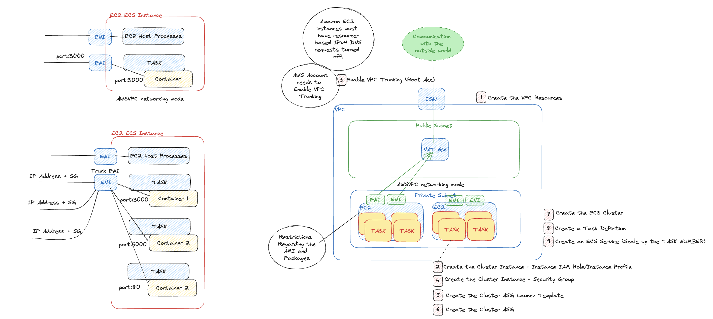

# AWS ECS - EC2 Cluster Enable Elastic Network Interface Trunking
- Each Amazon ECS task that uses the awsvpc network mode receives its own elastic network interface (ENI), which is attached to the container instance that hosts it. There is a default limit to the number of network interfaces that can be attached to an Amazon EC2 instance, and the primary network interface counts as one.
- Because each task using the awsvpc network mode requires an ENI, the number of tasks are very limited aand are depends on the instance type
- Amazon ECS supports launching container instances with increased ENI density using supported Amazon EC2 instance types. When you use these instance types and enable the awsvpcTrunking account setting, additional ENIs are available on newly launched container instances.
- This configuration allows you to place more tasks using the awsvpc network mode on each container instance.
- The container instance will have the primary network interface and Amazon ECS creates and attaches a "trunk" network interface to the container instance. So this configuration allows you to launch more tasks on the container instance instead of the current two tasks.
- This is a technique for multiplexing data over a shared communication link.

## Requirements
1. Create an ECS Cluster with AutoScaling Group
      1. Select instances where the ENI Trunking is supported
1. Have ENI Trunking Enable at account level for the Cluster Instance IAM Role Principle
1. Create a Task definition with `awsvpc` network mode!
1. Scale up a service with more tasks than the number of ENIs of the EC2 instances within the AutoScaling Group
1. Examine what happened
1. Clean Up! Don't Forget to Delete the Resources

## Architecture


## Good to Know
#### ENI trunking considerations
- Only Linux variants of the Amazon ECS-optimized AMI, or other Amazon Linux variants with version 1.28.1 or later of the container agent and version 1.28.1-2 or later of the ecs-init package, support the increased ENI limits. If you use the latest Linux variant of the Amazon ECS-optimized AMI, these requirements will be met. Windows containers are not supported at this time.
- Only new Amazon EC2 instances launched after enabling awsvpcTrunking receive the increased ENI limits and the trunk network interface. Previously launched instances do not receive these features regardless of the actions taken.
- Amazon EC2 instances must have resource-based IPv4 DNS requests turned off. To disable this option, ensure the Enable resource-based IPV4 (A record) DNS requests option is deselected when creating a new instance using the Amazon EC2 console. To disable this option using the AWS CLI, use the following command.
    - `aws ec2 modify-private-dns-name-options --instance-id i-xxxxxxx --no-enable-resource-name-dns-a-record --no-dry-run`
- When you enable awsvpcTrunking, container instances receive an additional ENI that uses the VPC's default security group, and is managed by Amazon ECS.

#### Disable Resource Based IPv4 Requests
- Amazon EC2 instances must have resource-based IPv4 DNS requests turned off. To disable this option, ensure the Enable resource-based IPV4 (A record) DNS requests option is deselected when creating a new instance using the Amazon EC2 console.
`aws ec2 modify-private-dns-name-options --instance-id i-xxxxxxx --no-enable-resource-name-dns-a-record --no-dry-run`

## Tips and Tricks
#### Enable ENI Trunking with Root Account
```sh
aws ecs put-account-setting \
      --name awsvpcTrunking \
      --value enabled \
      --principal-arn <instance profile/iam role arn> \
      --region <region>
```
#### Check the EC2 Instance of the Cluster regarding ENI Trunking
```sh
aws ecs list-attributes \
      --target-type container-instance \
      --attribute-name ecs.awsvpc-trunk-id \
      --cluster <cluster name> \
      --region <region>
```

## Resources
1. [ECS Container Instances](https://docs.aws.amazon.com/AmazonECS/latest/developerguide/container-instance-eni.html)
1. [ENI Trunking](https://docs.aws.amazon.com/AmazonECS/latest/developerguide/container-instance-eni.html#eni-trunking-launching)