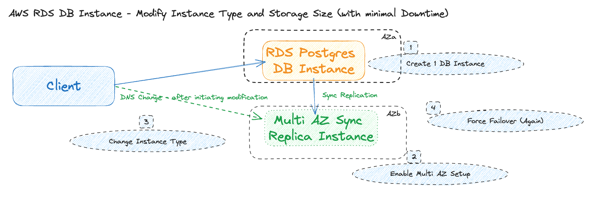

# AWS RDS - Modifying Instance Type (with near to Zero Downtime) (PostgreSQL)
In the following lecture I would like to demonstrate how to modify the Type of an RDS Database Instance with `near to zero` downtime. This method involves enabling High Availability Feature of RDS Instances with sync replication.

## Requirements
1. Create an RDS PostgreSQL Database (for myself at the point of recording v15.3 was used as Database Engine)
    - Use the Default Parameter Group (PGD)
    - Don't enable Multi AZ By Default
1. Add a MultiAZ Capabilities
1. Modify Instance Class
    1. Examine the connection during the Change
1. Force Failover after the Istance Class Change (because the primary node is in the (secondary AZ))
    1. Examine the connection during the Change
1. Disable Multi AZ
1. Increase Storage Size


## Desired Architecture


## Tips and Tricks
#### Connecting to PostgreSQL Database
```sh
psql "host=<db hostname> port=5432 user=postgres dbname=postgres"
```

#### Show Server IP Address PostgreSQL Query
```sql
SELECT inet_server_addr();
```
## Resources
1. [Modifying an RDS Instance](https://docs.aws.amazon.com/AmazonRDS/latest/UserGuide/Overview.DBInstance.Modifying.html)
1. [Configuring and managing Multi AZ RDS Instance](https://docs.aws.amazon.com/AmazonRDS/latest/UserGuide/Concepts.MultiAZ.html)
1. [Converting Single AZ instance to Multi AZ](https://repost.aws/knowledge-center/rds-convert-single-az-multi-az)
1. [Working with RDS Storage](https://docs.aws.amazon.com/AmazonRDS/latest/UserGuide/USER_PIOPS.StorageTypes.html)