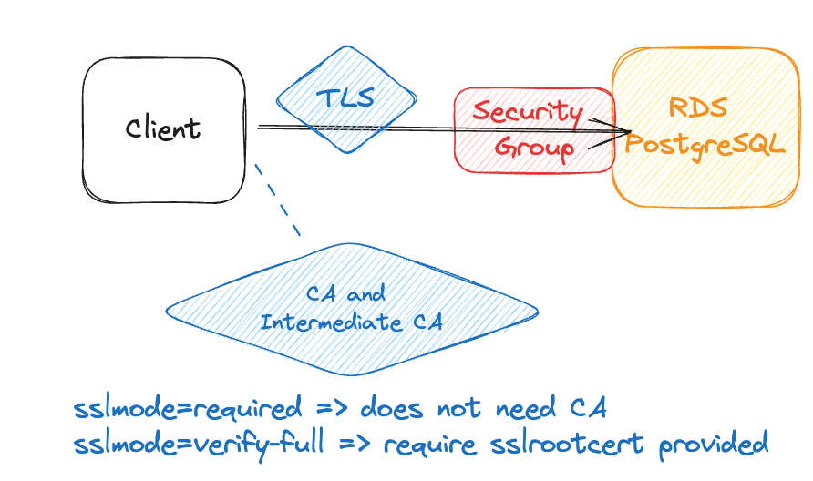

# AWS RDS - Use Encryption in Transit (PostgreSQL)
- The purpose of this exercise is to learn how to use encryption in transit in the aspect of RDS PostgreSQL. I would like you to discover these features.

## Requirements
1. Create an RDS PostgreSQL Database (for myself at the point of recording v15.3 was used as Database Engine)
    - Use Defaults - make it publicly available
1. Connect to the Database
    - investigate the SSL Options
1. Connect with the `sslmode=verify-full` option - Use Encryption in Transit
1. Update the Certificate to the `rds-ca-rsa2048-g1` certificate from `rds-ca-2019`

## Desired Architecture


## Tips and Tricks

#### Connecting to PostgreSQL with PSQL and ssmode=verify-full
```sh
psql "host=<db hostname> port=5432 user=postgres dbname=postgres sslmode=verify-full sslrootcert=/Users/<user>/Downloands/eu-central-1-bundle.pem"
```

#### Describing SSL Settings on Postgres
```sql
SELECT name as "Parameter name", setting as value, short_desc FROM pg_settings WHERE name LIKE '%ssl%'
```

#### AWS CLI Describe AWS RDS Engine Versions
```sh
aws rds describe-db-engine-versions \
    --engine postgres \
    --engine-version 15.3
```

#### Download the Certifications
- Select the right one from here (based on Region) -> [Download Links Here](https://docs.aws.amazon.com/AmazonRDS/latest/UserGuide/UsingWithRDS.SSL.html)

## Resources
1. [Using SSL with a PostgreSQL DB instance](https://docs.aws.amazon.com/AmazonRDS/latest/UserGuide/PostgreSQL.Concepts.General.SSL.html)
1. [Updating applications to connect to PostgreSQL DB instances using new SSL/TLS certificates](https://docs.aws.amazon.com/AmazonRDS/latest/UserGuide/ssl-certificate-rotation-postgresql.html)
1. [Postgres libpq ssl](https://www.postgresql.org/docs/current/libpq-ssl.html)
1. [Using TLS to Encrypt DB Instances](https://docs.aws.amazon.com/AmazonRDS/latest/UserGuide/UsingWithRDS.SSL.html)

