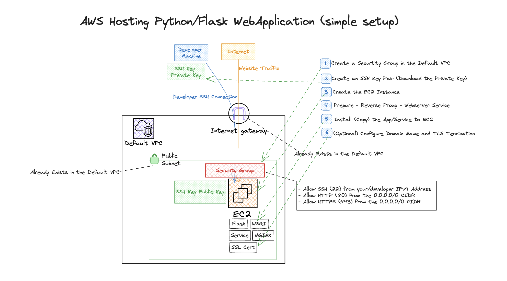

# AWS Hosting - Host a Python/Flask WebApplication on EC2 Instance

## Requirements (steps)
1. Create or Import a Flask Application
1. Create the Infrastructure
    1. Create an EC2 Instance
        1. Create a Security Group
            1. Allow SSH from your IPv4 Address
            1. Allow Traffic from 443 and from 80 from the Internet
        1. Create an SSH Key and add to the Instance
1. Configure a Python WSGI server (like Gunicorn)
1. Create a Linux Service running the WSGI Server with the Python WebApplication
1. Configure a Reverse Proxy (nginx)
1. `scp` the files to the EC2 Instance
1. Install a Reverse Proxy (nginx)
1. Run the Service
1. (Optional) Set Up SSL/TLS for the EC2 Instance
1. Test the Application

## Desired Architecture

## Tips and Tricks
#### Creating the Virtual Environment
`python3 -m venv .venv`

#### Activating the Virtual Environment
`source .venv/bin/activate`

#### Installing Flask
`pip install Flask`

#### Installing Gunicorn
`pip install gunicorn`

#### Running Gunicorn
`gunicorn -w 4 'hello:app'`
- The -w option specifies the number of processes to run; a starting value could be CPU * 2

#### Rsync from local to Remote
`rsync -av --exclude='__pycache__/' --exclude='.venv/' ./ flask:/home/ec2-user/`

#### Installing Certbot for NGINX
`sudo dnf install certbot`
`sudo dnf install python3-certbot-nginx`

#### Generate Let's Encrypt Cert
- Make sure your Domain Registrar has the A record for your Webserver
`sudo certbot certonly --nginx -d <your-domain>`