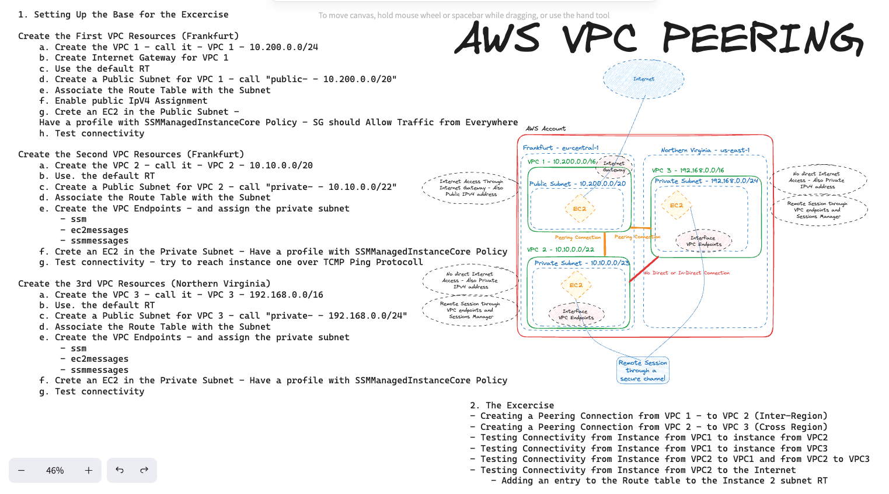

# AWS VPC - Peer VPC Inner and Cross Region
- You can peer any two VPCs in different Regions, as long as they have distinct, non-overlapping CIDR blocks. This ensures that all of the private IP addresses are unique, and it allows all of the resources in the VPCs to address each other without the need for any form of network address translation (NAT).
- The purpose of this exercise is to demonstrate how to setup Inner and Cross Region VPC Peering. 

## Exercise Requirements
1. Create 3 VPC (2 in one Region, 3rd in a different Region)
1. Establish VPC Peering Inner and Cross Region
    1. Don't forget to extend the Route Tables
    1. Make sure you don't have overlapping IP Address Ranges
    1. TEST the Connectivity
1. Clean Up! Don't Forget to Delete the Resources!

## Overview

## Resources
1. [VPC Peering](https://docs.aws.amazon.com/vpc/latest/peering/what-is-vpc-peering.html)
1. [Create VPC Peering Connections](https://docs.aws.amazon.com/vpc/latest/peering/create-vpc-peering-connection.html)
1. [Update Route Tables to reflect Peering](https://docs.aws.amazon.com/vpc/latest/peering/vpc-peering-routing.html)
1. [Reference Peer Security Groups](https://docs.aws.amazon.com/vpc/latest/peering/vpc-peering-security-groups.html)
